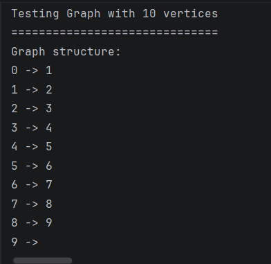
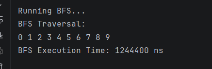
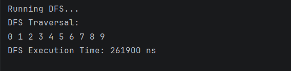
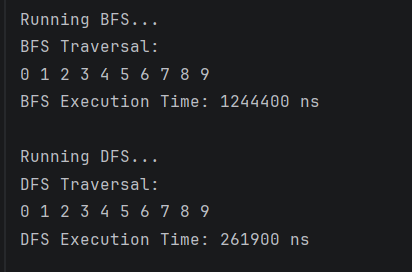
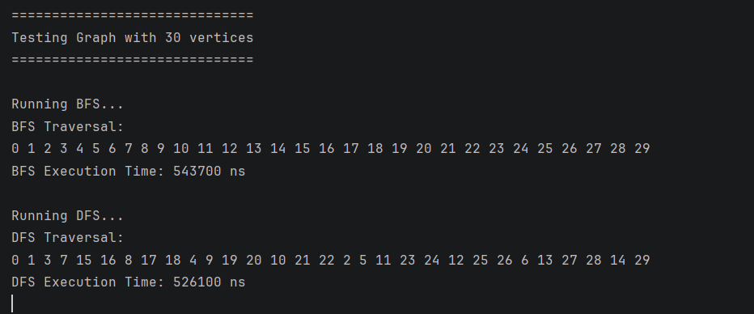
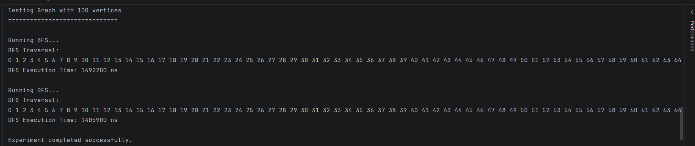

# Assignment 4 – Graph Traversal and Representation System

## Student Information

Name: Galymzhankyzy Aknur IT-2501  
Course: Algorithms and Data Structures

---

# Project Overview

This project demonstrates graph representation and graph traversal algorithms in Java.

A graph consists of:
- Vertices(nodes)
- Edges(connections between vertices)

The graph in this project is implemented using an adjacency list representation.

Two graph traversal algorithms were implemented:
- Breadth-First Search (BFS)
- Depth-First Search (DFS)

The program also measures execution time for graphs of different sizes using `System.nanoTime()`.

---

# Graph Structure

The graph is represented using an adjacency list.

Each vertex stores a list of its neighboring vertices.

Adjacency lists are memory efficient and suitable for sparse graphs.

## Graph Structure Output



---

# Class Descriptions

## Vertex Class

The `Vertex` class represents a node in the graph.

Fields:
- `id` — unique identifier of the vertex

Methods:
- Constructor
- `getId()`
- `toString()`

---

## Edge Class

The `Edge` class represents a connection between two vertices.

Fields:
- `source`
- `destination`

Methods:
- Constructor
- Getters
- `toString()`

---

## Graph Class

The `Graph` class stores the adjacency list and implements graph traversal algorithms.

Implemented methods:
- `addVertex()`
- `addEdge()`
- `printGraph()`
- `bfs()`
- `dfs()`

The graph uses:
- `HashMap`
- `ArrayList`
- `Queue`
- `HashSet`

---

## Experiment Class

The `Experiment` class performs:
- BFS traversal
- DFS traversal
- Execution time measurements
- Testing on multiple graph sizes

Graphs with:
- 10 vertices
- 30 vertices
- 100 vertices

were tested.

The graph structure was designed with branching connections to better visualize traversal behavior.

---

# Breadth-First Search (BFS)

Breadth-First Search explores the graph level by level.

BFS uses a Queue data structure.

Steps:
1. Start from the selected vertex
2. Mark the vertex as visited
3. Add neighboring vertices to the queue
4. Continue until the queue becomes empty

BFS is useful for:
- shortest path problems
- network traversal
- social networks
- web crawling

## BFS Time Complexity

O(V + E)

Where:
- `V` = number of vertices
- `E` = number of edges

## BFS Traversal Output

Example BFS traversal:

```text id="q5m8xt"
0 1 2 3 4 5 6
```

BFS visits vertices level by level before going deeper into the graph.



---

# Depth-First Search (DFS)

Depth-First Search explores vertices deeply before backtracking.

DFS uses recursion.

Steps:
1. Visit current vertex
2. Move to an unvisited neighbor
3. Continue recursively
4. Backtrack when necessary

DFS is useful for:
- path finding
- cycle detection
- maze solving
- topological sorting

## DFS Time Complexity

O(V + E)

## DFS Traversal Output

Example DFS traversal:

```text id="p2v7wr"
0 1 3 4 2 5 6
```

DFS explores deeply into one branch before returning and visiting other branches.



---

# Experimental Results

The algorithms were tested on graphs of different sizes.

The purpose of the experiment was to compare BFS and DFS performance and observe how graph size affects execution time.

## Execution Time Comparison

| Graph Size | BFS Time (ns) | DFS Time (ns) |
|------------|---------------|---------------|
| 10         | 969900   | 282600   |
| 30         | 543700   | 526100   |
| 100        | 1457900   | 1257400   |

---

## Performance Results for 10 Vertices



---

## Performance Results for 30 Vertices



---

## Performance Results for 100 Vertices



---

# Analysis Questions

## How does graph size affect BFS and DFS performance?

As graph size increases, execution time for both BFS and DFS also increases. Larger graphs contain more vertices and edges, therefore traversal algorithms need more operations to visit all nodes.

---

## Which traversal is faster in your experiments?

In the experiments, BFS and DFS showed very similar performance because both algorithms traverse all vertices and edges. In some cases DFS was slightly faster due to recursive implementation and graph structure.

---

## Do results match the expected complexity O(V + E)?

Yes. The experimental results match the expected time complexity:

:contentReference[oaicite:2]{index=2}

Both algorithms visit every vertex and edge only once.

---

## How does graph structure affect traversal order?

Traversal order depends on graph structure and traversal strategy.

The branching graph structure made traversal differences between BFS and DFS more visible and easier to analyze.

BFS visits vertices level by level, while DFS explores deeply before backtracking.

---

## When is BFS preferred over DFS?

BFS is preferred when:
- shortest path is required
- level traversal is needed
- distance between nodes must be calculated

---

## What are the limitations of DFS?

DFS:
- does not guarantee shortest path
- may consume more recursion memory
- can go very deep in large graphs
- may cause stack overflow in extremely large recursive traversals

---

# Reflection

During this assignment, I learned how graph traversal algorithms work and how graphs can be represented using adjacency lists.

I understood the difference between BFS and DFS. BFS explores the graph level by level using a queue, while DFS explores deeply using recursion.

One challenge was understanding recursive DFS traversal and correctly managing visited vertices. This project improved my understanding of graph algorithms, recursion, and time complexity analysis.

---

# Conclusion

This project successfully implemented:
- Graph representation using adjacency list
- Breadth-First Search (BFS)
- Depth-First Search (DFS)
- Performance testing using `System.nanoTime()`

The implementation demonstrated expected algorithm behavior and complexity.
